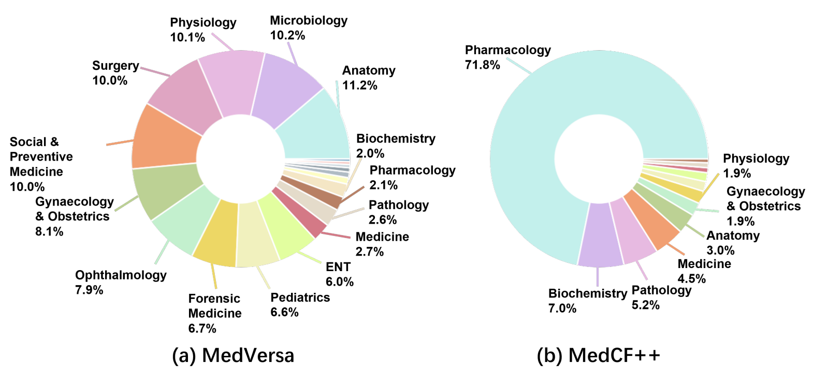

# [ICML 2026] MedREK: Retrieval-Based Editing for Medical LLMs with Key-Aware Prompts.

[](https://arxiv.org/abs/2510.13500)
[](https://huggingface.co/datasets/erinxia/MedVersa)

Source code for ICML 2026 (main) paper "[**MedREK: Retrieval-Based Editing for Medical LLMs with Key-Aware Prompts**](https://openreview.net/pdf?id=XFHjS8kw6X)".


## 📰 News

* [2025/04/30] 🎉 MedREK has been accepted by **ICML 2026 Main Conference**! 
* [2025/11/07] 🎉 MedREK has been accepted by ResponsibleFM @ NeurIPS 2025! 
* [2025/10/16] 🚀 Our paper is available on arXiv! 
* [2025/10/15] 🔥 We release the MedVersa dataset and code for MedREK!


## 👀 Introduction


- We present the **first batch-editing benchmark** in medical scenarios with broader coverage of medical subjects.

- We propose **MedREK**, a retrieval-based editing framework that integrates a **shared query-key module** for precise matching with an **attention-based prompt encoder** for informative guidance.

- Experimental results on various medical benchmarks demonstrate that our MedREK achieves superior performance across different core metrics and provides the **first validated solution for batch-editing in medical LLMs**.




## 🔧 Setup

```bash
conda create -n medrek python=3.10 -y
conda activate medrek
git clone https://github.com/mylittleriver/MedREK
pip install --upgrade medrek 
pip install -r requirements.txt
```

First enter the `medrek` directory: `cd medrek`

In `utils/global_attrs.py`, change  `ROOT_PATH` and `MODEL_PATH` to your paths.

## 📊 MedVersa

Please check the `/medversa` floder to see the `train\valid\test` split of our enhanced **Medical LLM Model Editing** Benchmark.


## ⚙️ Train MedREK

Please run:
``` bash
python train_medrek.py -mn 'meditron-7b' -dn 'medcf'  
```
Checkpoints will be saved in `train_records/recipe/meditron-7b/train_name/checkpoints/`.

You can view training information in `train_records/recipe/meditron-7b/train_name/logs/` through Tensorboard.

We also provide the implementation of [RECIPE](https://arxiv.org/abs/2405.03279) for medical LLM model editing. Please check the `RECIPE` floder.

## 💫 Evaluate MedREK

Please run:
```bash
python test_medrek.py -en 'medrek' -mn 'meditron-7b' -et 'batch' -dvc 'cuda:0' \
    -ckpt 'train_records/recipe/meditron-7b/train_name/checkpoints/a_checkpoint' \
    -dn 'medcf' -edn 100 \
```
You can check results in `eval_results/medrek`.


## 🙏 Acknowledgement
This repo is built upon the following projects: 

* [RECIPE](https://github.com/qizhou000/RECIPE)
* [MedLaSA](https://github.com/quqxui/MedLaSA)

We thank the authors for their codes.


## 📝 Citation
Please cite our work if you use our code or discuss our findings in your own research:
```bibtex
@article{xia2025medrek,
  title={MedREK: Retrieval-Based Editing for Medical LLMs with Key-Aware Prompts},
  author={Xia, Shujun and Lin, Haokun and Wu, Yichen and Zhou, Yinan and Li, Zixuan and Wan, Zhongwei and Xing, Xingrun and Zheng, Yefeng and Li, Xiang and Shan, Caifeng and others},
  journal={arXiv preprint arXiv:2510.13500},
  year={2025}
}
```
